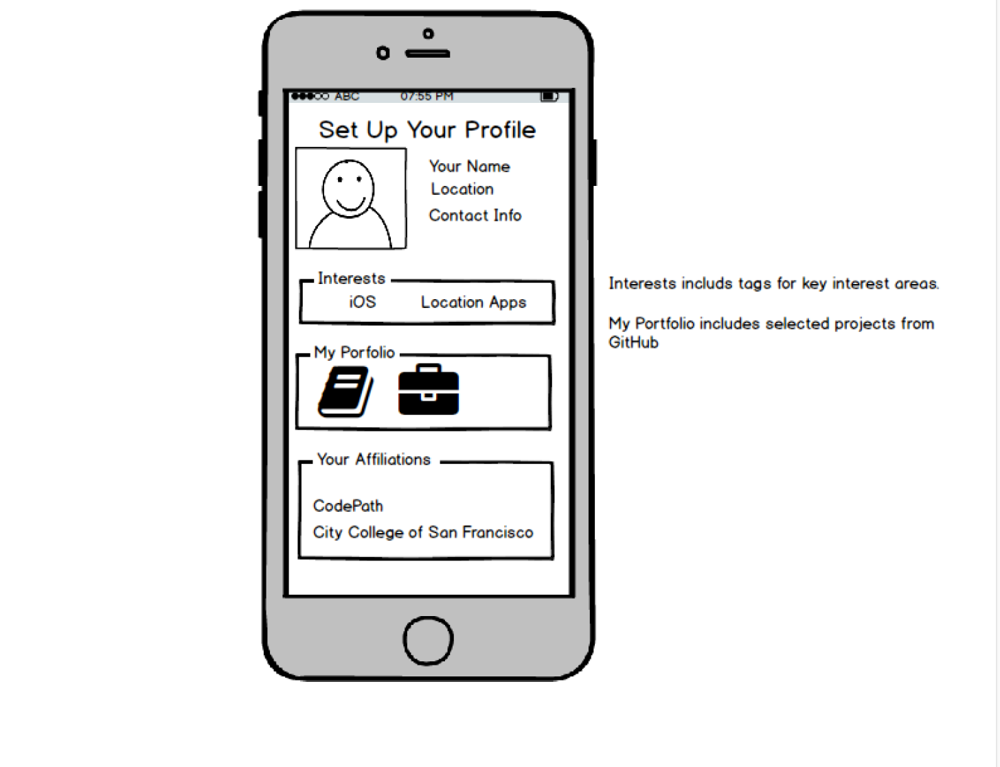
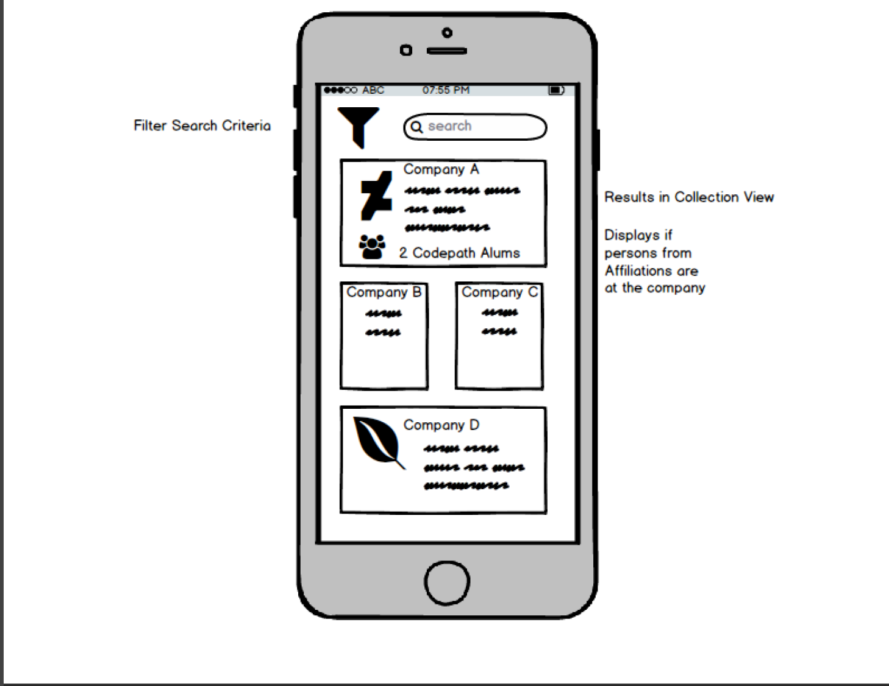
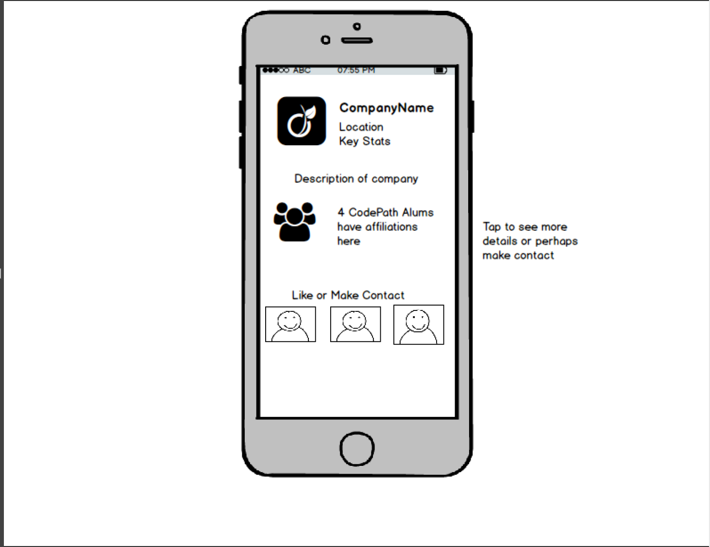

# Group Project - *linkbase*
Team: Robert Hernandez, Michael Leung, Barbara Ristau

Linkbase is an app that "links" users with affiliations to different companies to get your next job

## User Stories

The following **required** functionality is complete:

- [x] Initial Project is set up

Login Related Features:

- [ ] User can create a new account
- [ ] User can log into an existing account
- [ ] User is persisted across app restarts
- [ ] User can edit personal info in Profile Home Page
- [ ] Profile Home Page displays tableview for competencies
- [ ] User can add competencies / languages in the Profile Home Page
- [ ] User can select language to add/edit projects or affiliations
- [ ] User can add affiliations
- [ ] User can add projects
- [ ] Gesture enabled matching with animation (horizontal scroll)
- [ ] User can toggle add/edit view between affiliations and projects
- [ ] User can add icon for affiliation or project, or else use default placeholder icon

Company Related Features:

- [x] Home timeline presented in 2-3 sections (3rd section for optional) with collection view in section 2
- [ ] Home timeline header in section 1
- [ ] User can swipe to save company to favorites
- [x] Tab bar controller set up in IB with icons for 1) Home, 2) Explore, 3) Favorites, and 4) Settings
- [ ] Search Bar at top of page in nav bar
- [ ] Profile icon as left nav bar, which segues to Profile VC, and icon on right, which segues to challenge section
- [x] Detail page shows company detail
- [x] Selecting company in home timeline goes to detail page
- [x] Favorites shows companies in tile format
- [ ] Selecting title goes to detail page
- [ ] Map view displays companies within radius of current location
- [x] Settings page allows user to change settings

Challenge Related Features:

- [ ] Alert asks user to select where to go
- [X] Comms View Controller - user is presented with question and button to get new question
- [X] Comms View Controller - user can record answer
- [X] Hud view is displayed after successful submission
- [ ] Tab bar with icons for stats, tech, comms sections
- [X] Tech View Controller presents question
- [X] User can select answer and submit
- [ ] Status bar tracks if 3 in a row is met with points, shows points
- [ ] Stats View Controller shows user name, photo, total points, and total questions answered
- [ ] Stats View Controller - user can press button to go to detailed results
- [ ] Results show tableview for question and points.  Same view controller for tech and comm questions.
- [ ] Grader View Controller - user can listen to recording and submit grade.

The following **optional** features are implemented:

- [ ] Login: Alert messages displayed for incorrect login
- [ ] Login: Password retrieval if forgot password
- [ ] Login: User can add video clip in profile page
- [ ] Company: Add additional swipe features (share)
- [ ] Company: Trending companies (raised $ in last week) in home timeline (section 3)
- [ ] Company: Matched affiliations shows on detail page
- [ ] Company: Affiliations shown in mapview
- [ ] Company: Hide search bar when scrolling down/up (Facebook example)
- [ ] Challenge: 3 in a row on tech challenge triggers sound animation
- [ ] Challenge: Detailed responses as separate VC or view
- [ ] Challenge: More analytics on stats
- [ ] Challenge: Stats - points from grading others

## Video Walkthrough

Here's a walkthrough of implemented user stories:

Click <a href="https://www.youtube.com/watch?v=nDXXWIjDtX0">here</a> to see the video of our Sprint 1.

GIF created with LiceCap(http://www.cockos.com/licecap/).

## Notes

## Wireframes

| Login |
| ---   |
|  |
| Feed |
| ---  |
|  |
| Detail |
| ---    |
|  |

## Schema

| Schema |
| ---    |
|  <a href="./Group2Schema_2017March13.pdf">See PDF!</a> |

## License

    Copyright 2017 [LinkBase by Robert, Barbarra, and Michael]

    Licensed under the Apache License, Version 2.0 (the "License");
    you may not use this file except in compliance with the License.
    You may obtain a copy of the License at

        http://www.apache.org/licenses/LICENSE-2.0

    Unless required by applicable law or agreed to in writing, software
    distributed under the License is distributed on an "AS IS" BASIS,
    WITHOUT WARRANTIES OR CONDITIONS OF ANY KIND, either express or implied.
    See the License for the specific language governing permissions and
    limitations under the License.
